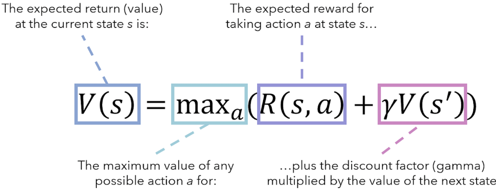
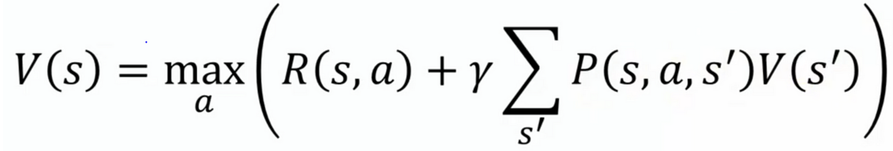
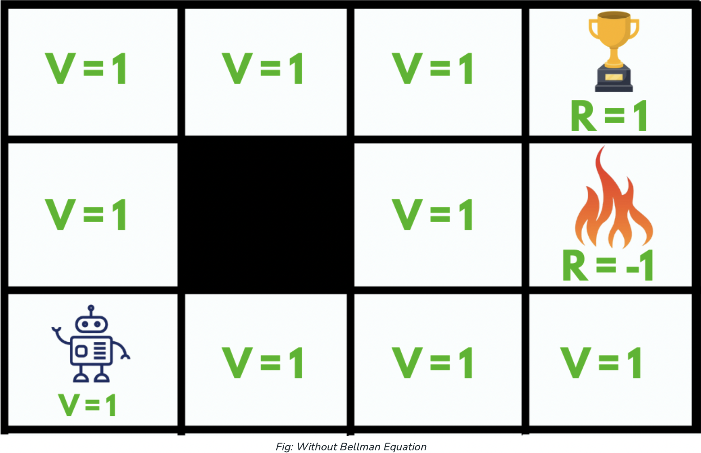
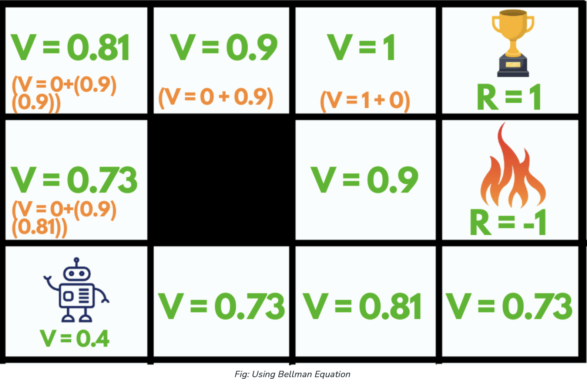

# Bellman Equation

According to the **Bellman Equation**, long-term- reward in a **given action is equal to the reward from the current action combined with the expected reward from the future actions** taken at the following time.  

  

  

The second equation is an extension of the first one. Add the states represented by V(S`) and multiply with the probabilities.  
**P(s, a, s′)** - the probability of moving from room s to room s′ with action a

**Concepts**:  

- **State(s)**: current state where the agent is in the environment
- **Next State(s’)**: After taking action(a) at state(s) the agent reaches s’
- **Value(V)**: Numeric representation of a state which helps the agent to find its path. V(s) here means the value of the state s.
- **Reward(R)**: treat which the agent gets after performing an action(a).
- **Discount factor(γ)**: determines how much the agent cares about rewards in the distant future relative to those in the immediate future. It has a value between 0 and 1. Lower value encourages short–term rewards while higher value promises long-term reward

**Reward**  
- R(s): reward for being in the state s
- R(s,a): reward for being in the state and performing an action a
- R(s,a,s’): reward for being in a state s, taking an action a and ending up in s’

Let’s take an example:  

Here we have a **maze** which is our environment and the sole **goal** of our agent is to reach the **trophy state (R = 1)** or to get **Good reward** and to **avoid the fire state** because it will be a **failure (R = -1)** or will get **Bad reward**.  

  

Initially, we will give our agent some time to explore the environment and let it figure out a path to the goal. As soon as it reaches its goal, it will **back trace its steps** back to its starting position and **mark values of all the states** which eventually leads towards the goal as **V = 1**.

The agent will face **no problem** until we **change its starting position**, as it will **not be able** to find a path towards the trophy state since the value of all the states is equal to 1. So, to solve this problem we should use **Bellman Equation**.  

With the current maze values if the agent starts at the position (0,0) instead of (2,0), then it wont know which direction to go as all values are 1.

So if we look at the Bellman equation above, the **max** denotes the most **optimum** action among all the actions that the agent can take in a particular state which can lead to the reward after **repeating this process every consecutive step**.

  

By using the Bellman equation our agent will calculate the value of every step except for the trophy and the fire state (V = 0), they cannot have values since they are the end of the maze.  

So, after making such a plan our agent can easily accomplish its goal by just following the increasing values.  
The gamma is called the discounting factor, and here we assume it to be 0.9.   

At (0,2), the reward of moving to the right is equal to 1 and regardless of what gamma is we don't have a value in this state because we are already in the best state possible. So this is the final state, it won't have a value, we just get a reward here and that's the end of the game.
So the value will be of this maximum will be equal to one and that's why value of state S here is equal to 1.  

At (0,1), if you go from here to right, you don't get any reward, it'll still be a zero, but then you'll get gamma, so you get 0.9 times the value of the new state, which is one. So in this case the value, the whole result of this is 0.9 times 1 equals 0.9.  

At (0,0), its 0 + 0.9 times the value of the next state which is 0.9, so 0.81. And so on.  

