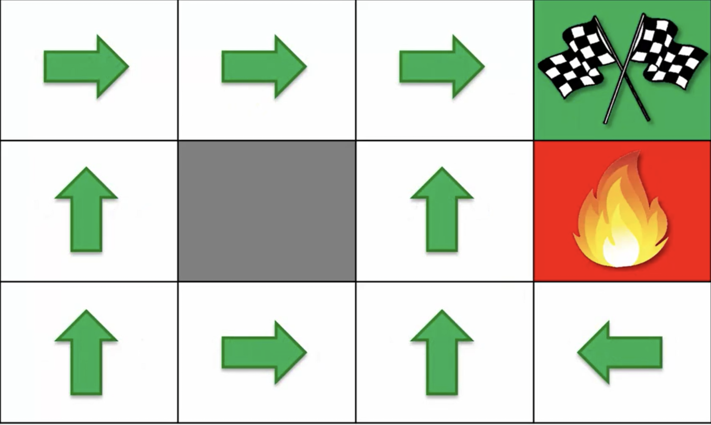

# Markov Decision Process

A stochastic process has the **Markov property** if the conditional probability distribution of future states of the process (conditional on both past and present states) depends only upon the present state, not on the sequence of events that preceded it. A process with this property is called a **Markov process**.  

**Markov decision process (MDP)** provide a mathematical framework for modeling decision making in situations where outcomes are partly random and partly under control of a decision maker.  

A **Markov Decision Process (MDP)** model contains:  
- A set of possible world states S.
- A set of Models.
- A set of possible actions A.
- A real-valued reward function R(s,a).
- A policy the solution of Markov Decision Process.

**State**: A State is a set of tokens that represent every state that the agent can be in.  

**Model**: A Model (sometimes called Transition Model) gives an action’s effect in a state. In particular, **T(S, a, S’)** defines a transition T where being in state S and taking an action ‘a’ takes us to state S’ (S and S’ may be the same). For stochastic actions (noisy, non-deterministic) we also define a probability **P(S’|S,a)** which represents the probability of reaching a state S’ if action ‘a’ is taken in state S. Note Markov property states that the effects of an action taken in a state depend only on that state and not on the prior history.  

**Action**: An Action A is a set of all possible actions. A(s) defines the set of actions that can be taken being in state S.  

**Reward**: A Reward is a real-valued reward function. **R(s)** indicates the reward for simply being in the state S. **R(S,a)** indicates the reward for being in a state S and taking an action ‘a’. **R(S,a,S’)** indicates the reward for being in a state S, taking an action ‘a’ and ending up in a state S’.  

**Policy**: A Policy is a solution to the Markov Decision Process. A policy is a mapping from S to a. It indicates the action ‘a’ to be taken while in state S.  

**Deterministic search Vs Non-Deterministic search**
  

Deterministic search means that if the agent decides to go up, then with a hundred percent probability, it will go up.  
 
Non-deterministic search is when our agent says it wants to go up, there could be three options. With an 80% chance it does go up. But then with a 10% chance when it wants to go up, it'll actually go to the left, just because, because that's how the environment works, that's the world that it lives in. And with another 10% chance, it'll actually go right, and, in this case, it'll fall into the fire pit.  
That's an example of a non-deterministic search a stochastic process.  

  

# Plan Vs Policy

In the chapter for Bellman equation we looked at example of a maze. In that maze based on thr values we assigned to each boxes we can come with a plan for reaching the reward state as:

  

However in real world we need to consider some randomness factor in each block or box.  

**A plan is a sequence of actions**. A policy 𝜋 is a function that maps states to actions (or probability distributions over actions). So, given a sequence of states 𝑠1,…,𝑠𝑁, a deterministic policy will give you a sequence of actions 𝜋(𝑠1),…,𝜋(𝑠𝑁)=𝑎1,…,𝑎𝑁, which can be thought of as a plan. If 𝜋 is stochastic, you need to sample actions, so the same policy can give you multiple different plans.

  

A **deterministic policy** is a function of the form 𝜋𝕕:𝑆→𝐴, that is, a function from the set of states of the environment, 𝑆, to the set of actions, 𝐴. The subscript 𝕕 only indicates that this is a 𝕕eterministic policy.

For example, in a grid world, the set of states of the environment, 𝑆, is composed of each cell of the grid, and the set of actions, 𝐴, is composed of the actions "left", "right", "up" and "down". Given a state 𝑠∈𝑆, 𝜋(𝑠) is, with probability 1, always the same action (e.g. "up"), unless the policy changes.

A **stochastic policy** can be represented as a family of conditional probability distributions, 𝜋𝕤(𝐴∣𝑆), from the set of states, 𝑆, to the set of actions, 𝐴. A probability distribution is a function that assigns a probability for each event (in this case, the events are actions in certain states) and such that the sum of all the probabilities is 1.

A stochastic policy is a family and not just one conditional probability distribution because, for a fixed state 𝑠∈𝑆, 𝜋𝕤(𝐴∣𝑆=𝑠) is a possibly distinct conditional probability distribution. In other words, 𝜋𝕤(𝐴∣𝑆)={𝜋𝕤(𝐴∣𝑆=𝑠1),…,𝜋𝕤(𝐴∣𝑆=𝑠|𝑆|)}, where 𝜋𝕤(𝐴∣𝑆=𝑠) is a conditional probability distribution over actions given that the state is 𝑠∈𝑆 and |𝑆| is the size of the set of states of the environment.

# Living Penalty

  

In the first case the <u>living penalty is 0</u>, so no penalty for staying alive. So in the box (1,2) the arrow points to the wall in (1,1), because its much safer to hit the wall than going into the fire pit and then eventually the agent will move into one of the safer boxes later. 

And same thing at (2,3), it's much safer for agent to jump into the wall hoping that one of these will come up eventually, and then it'll go to the finish line anyway because by choosing these two actions, it doesn't risk getting into the fire pit.

Now in the second case <u>R(s)=-0.04, a negative reward for just being alive</u>, for making a step, making a move. So here you can see that instantly the above two arrows at (1,2) and (2,3) changed. Now the agent doesn't want to jump into the wall. It is more likely to risk getting to the fire pit having a 10% chance of jumping into the pit, but it decides to go forward with an up arrow. Every time it jumps into the wall (like in previous case), it performs an action and ends in this state with an 80% chance. And that means with an 80% chance, it'll get a minus 0.04 reward, meaning that a lot of the time it's going to be getting this accumulating a negative reward.

Same thing at (2,3), that if you perform the calculations the resulting value of jumping to the wall so many times is far worse than taking the risk of going forward and actually ending up in the fire pit. Simply because now the longer it's alive the longer accumulate this living penalty in the next environment.

In third case we're increasing the <u>living penalty to even a greater number minus 0.5</u>. Here the arrow in (2,1) has changed to point to right and also (2,2) is pointing to up. And what that means is that now it's no longer a good option for the agent to take a longer route even though it's safer because it will accumulate quite a substantial negative reward as it walks around longer. 

As soon as agent ends up in the square (1,2), there's a 10% chance of getting to the fire pit. But the expected value of this approach is better than the expected value of going around simply because we've increased this living penalty.

And finally, we are getting to the example with the <u>living penalty of minus 2.0</u>. Remember that the penalty for reaching the fire pit is only minus 1.0. The penalty is so high that the agent just wants to get out of the game in any way possible, even if it's just by jumping into the fire pit. Every time agent makes a step, every time it ends up in a new state, or every time it makes an action it ends up getting a minus two reward.

So what's the point of trying to get to the finish line if from (2,3) it will take me one extra steps and go straight into the fire pit because that way reward is going to be less, the negative reward is not gonna be as bad as in the case of just making additional steps.

So you can see that adding this living reward and depending on the value of the living reward, the results are going to be different. And the agent is going to select different policies.  

