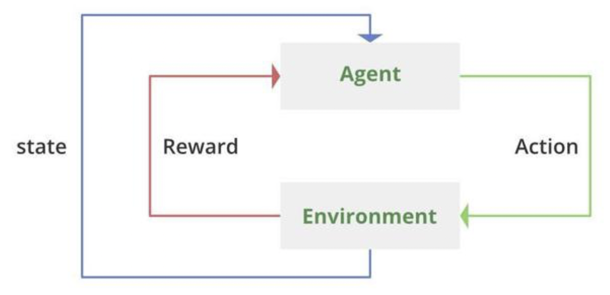

# Reinforcement learning

**Reinforcement learning** is a machine learning training method based on rewarding desired behaviours and punishing undesired ones. In general, a reinforcement learning agent -- the entity being trained -- **is able to perceive and interpret its environment, take actions and learn through trial and error**.  

Reinforcement learning differs from supervised learning in a way that in supervised learning the training data has the answer key with it so the model is trained with the correct answer itself whereas in reinforcement learning, there is no answer but the reinforcement agent decides what to do to perform the given task. The data is accumulated from machine learning systems that use a trial-and-error method. **Data is not part of the input** that we would find in supervised or unsupervised machine learning.  

It is a good technique to use for automated systems that have to make a lot of small decisions without human guidance.  

**Main points in Reinforcement learning** 
- **Input**: The input should be an initial state from which the model will start
- **Output**: There are many possible outputs as there are a variety of solutions to a particular problem
- **Training**: The training is based upon the input, The model will return a state and the user will decide to reward or punish the model based on its output.
- The model **continues to learn**.
- The best solution is decided based on the **maximum reward**.

| Reinforcement learning                                                                                                                                                                                                  | Supervised learning                                                                                      |
|-------------------------------------------------------------------------------------------------------------------------------------------------------------------------------------------------------------------------|----------------------------------------------------------------------------------------------------------|
| Reinforcement learning is all about making decisions sequentially. In simple words, we can say that the output depends on the state of the current input and the next input depends on the output of the previous input |     In Supervised learning, the decision is made on the initial input or the input given at the start    |
|                                                          In Reinforcement learning decision is dependent, So we give labels to sequences of dependent decisions                                                         | In supervised learning the decisions are independent of each other so labels are given to each decision. |
|                                                                                          Example: Chess game,text summarization                                                                                         |                                Example: Object recognition,spam detetction                               |

 

**Types of Reinforcement**  
There are two types of Reinforcement  
- **Positive**: Positive Reinforcement is defined as when an event, occurs due to a particular behavior, increases the strength and the frequency of the behavior. In other words, it has a positive effect on behavior. 
- **Negative**: Negative Reinforcement is defined as strengthening of behavior because a negative condition is stopped or avoided. 

**Elements of Reinforcement Learning**  
Reinforcement learning elements are as follows:  
- **Policy**: Policy defines the learning agent behavior for given time period. It is a mapping from perceived states of the environment to actions to be taken when in those states.

- **Reward function**: Reward function is used to define a goal in a reinforcement learning problem.A reward function is a function that provides a numerical score based on the state of the environment

- **Value function**: Value functions specify what is good in the long run. The value of a state is the total amount of reward an agent can expect to accumulate over the future, starting from that state.

- **Model of the environment**: Models are used for planning.

The reinforcement learning problem model is **an agent continuously interacting with an environment**. The agent and the environment interact in a sequence of time steps. At each time step t, the agent receives the state of the environment and a scalar numerical reward for the previous action, and then the agent then selects an action.

**RL can be used in large environments in the following situations**:  
- A model of the environment is known, but an analytic solution is not available;
- Only a simulation model of the environment is given (the subject of simulation-based optimization)
- The only way to collect information about the environment is to interact with it.

**Advantages of Reinforcement learning**  
- Reinforcement learning can be used to solve very complex problems that cannot be solved by conventional techniques.
- The model can correct the errors that occurred during the training process. 
- In RL, training data is obtained via the direct interaction of the agent with the environment
- Reinforcement learning can handle environments that are non-deterministic, meaning that the outcomes of actions are not always predictable. This is useful in real-world applications where the environment may change over time or is uncertain.

**Disadvantages of Reinforcement learning**
- Reinforcement learning is not preferable to use for solving simple problems.
- Reinforcement learning needs a lot of data and a lot of computation
- Reinforcement learning is highly dependent on the quality of the reward function. If the reward function is poorly designed, the agent may not learn the desired behavior.
- Reinforcement learning can be difficult to debug and interpret. It is not always clear why the agent is behaving in a certain way, which can make it difficult to diagnose and fix problems.

  

Gone is the ability to simply get the algorithm to pair certain stimuli with certain responses. Instead RL algorithms must enable the agent to learn the correct pairings itself through the use of observations, rewards, and actions.

**Typical aspects of a task that make it an RL problem are the following**:  
- Different actions yield different rewards. For example, when looking for treasure in a maze, going left may lead to the treasure, whereas going right may lead to a pit of snakes.
- Rewards are delayed over time. This just means that even if going left in the above example is the right things to do, we may not know it till later in the maze.
- Reward for an action is conditional on the state of the environment. Continuing the maze example, going left may be ideal at a certain fork in the path, but not at others.